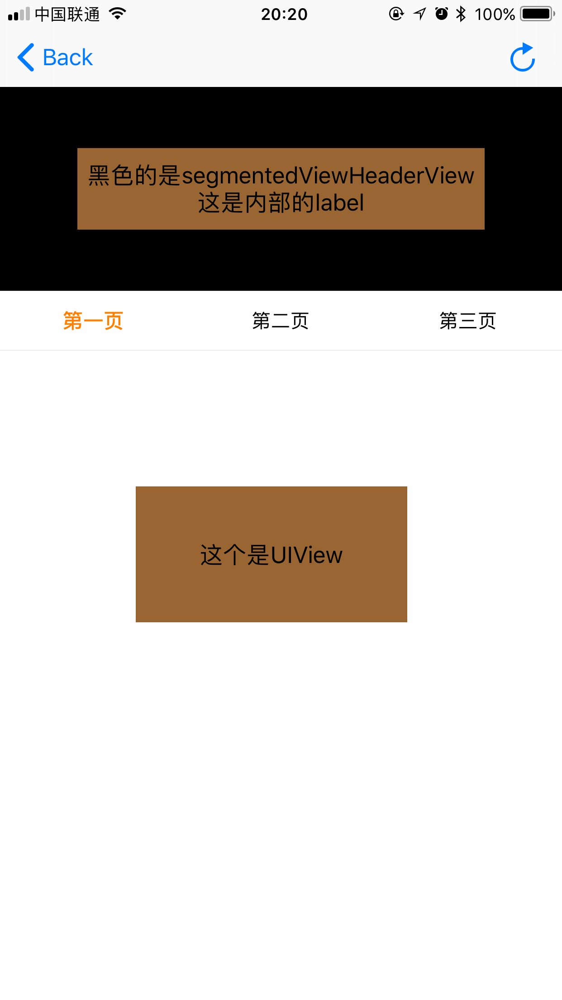

TSegmentedView
------

[中文文档](README_CN.md)


### Features

- perfectly compatible with `Objective-C` and` swift`
- support user scorll and click tab
- support slide back(in any tab)
- support `Frame` and `Autolayout`, you can use `Masonry`/`SnapKit`/`NSLayoutConstraint` layout views
- support in the ordinary `UIView` (and the non-sliding `UIView subclass View`), `UIScrollView`,` UITableView`
- support `UITableView` add` tableHeaderView` 
- support `UITableView` to add section header view, and show that there will be no hover position is not correct
- support custom `SegmentedControlView` (tab click) style, you can set their own animation, set their own height and so on

> support UIView



> support UIScrollView


> support UITableView add tableHeaderView


> support UITableView add section header


### Why wrote `TSegmentedView`
Now a lot of similar framework, but still do one, mainly because most of the framework of the Internet to write the `SegmentedControlView` (that is, tab style), the other important point is that I have tried a lot of frames found` UITableView` `tableHeaderView `There will be problems, and once the section header view, hover has a problem, so I wrote this ...


### How to use

You can see the specific use of the demo, the following is a specific introduction

#### Compliance Protocol: `TSegmentedViewDelegate`

```swift
func segmentedViewTitles(in segmentedView: TSegmentedView) -> [String]

func segmentedView(_ view: TSegmentedView, viewForIndex index: Int) -> UIView
```

- the first function is to `TSegmentedView` no tab of the title assignment, array count is the number of tabs
- The second function is to give each tab a view

optional protocol functions

```swift
// 1 
@objc optional func segmentedView(_ view: TSegmentedView, didShow index: Int) -> Void

// 2
@objc optional func segmentedViewSegmentedControlView(in segmentedView: TSegmentedView) -> UIView

// 3
// default is 0
@objc optional func segmentedViewFirstStartSelectIndex(in segmentedView: TSegmentedView) -> Int

// 4
// default is nil
@objc optional func segmentedViewHeaderView(in segmentedView: TSegmentedView) -> UIView

// 5
// default is segmentedViewHeaderView height
@objc optional func segmentedViewHeaderMaxHeight(in segmentedView: TSegmentedView) -> CGFloat

// 6
// default is segmentedViewHeaderView height
@objc optional func segmentedViewHeaderMinHeight(in segmentedView: TSegmentedView) -> CGFloat

// 7
// when scroll top or bottom, change the titles view height , will run this method
@objc optional func segmentedView(_ view: TSegmentedView, didChangeHeaderHeightTo height: CGFloat) -> Void

```
- Optional function usage
  1. Function is in the index corresponding to the view will be called, will be called every time when select or scroll to the index
  2. The function returns the defined `SegmentedControlView` (the default is `TSegmentedControlView`)
  3. function returns `TSegmentedView` created when the choice of which tab (the default choice of the first tab -> index = 0)
  4. return headerView (default is nil)
  5. Set the maximum height of the header (the default size of the header view's frame height)
  6. Set the minimum height of the header (the default is the same as the maximum height)
  7. When the header height changes, this function is called, allowing some animations to be made according to the new hight


### about `TSegmentedControlProtocol`

You can see the definition of this protocol in `TSegmentedView.swift`

```swift
@objc protocol TSegmentedControlProtocol: class {
    func reloadData(with titles: [String]) -> Void
    func userScrollExtent(_ extent: CGFloat) -> Void
    func setAction(_ actionBlock: ((_ index: Int) -> Void)?) -> Void
}
```

- Why define `TSegmentedControlProtocol`:
  > `TSegmentedView` allows users to customize `SegmentedControlView` instead of having to use `TSegmentedControlView`'
- how to customize `SegmentedControlView`
  > The first view created must be a subclass of `UIView`, then conform to the `TSegmentedControlProtocol` protocol and implement these three methods
- `func reloadData (with titles: [String]) -> Void`
  > This method in the `TSegmentedView` `reloadData` when the call back, this method needs to be updated to achieve the corresponding tab to create a delete display and other operations, `titles` is `TSegmentedControlView` proxy method to return the array
- `func userScrollExtent (_ extent: CGFloat) -> Void`
  > This method in the `TSegmentedView` slide (the user manually slide) when the call back, this method needs to update the corresponding tab of the view display style or custom animation, `extent` the value of the current sliding ratio. For example, there are three tabs, the range is `0.0 ~ 2.0`
- `func reloadData (with titles: [String]) -> Void`
  > This method in the `TSegmentedView`` reloadData` back when the call, this method needs to be updated to achieve the corresponding tab to create a delete display and other operations
- `func setAction (_ actionBlock: ((_ index: Int) -> Void) -> Void`
  > This method requires you to save `actionBlock` and call` actionBlock` when you click tab, then, will scroll to the corresponding tab's view. (Initially considered to be in the protocol to define a `actionBlock` variable, in order to be compatible with `Objective-C`, it is defined as a function.)

