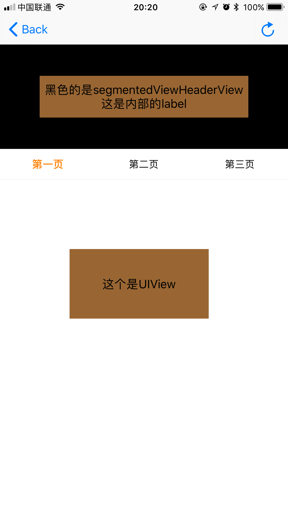
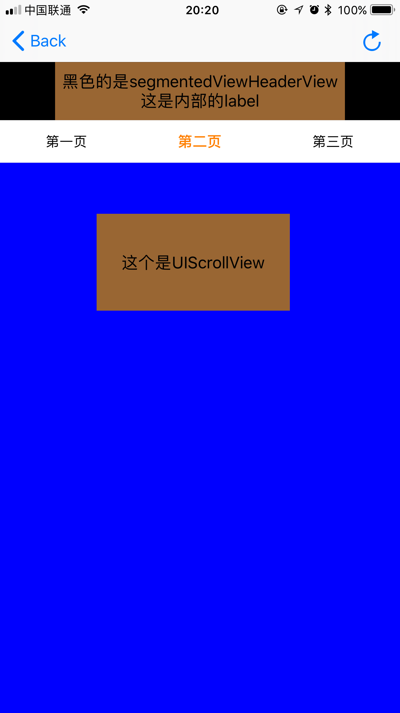
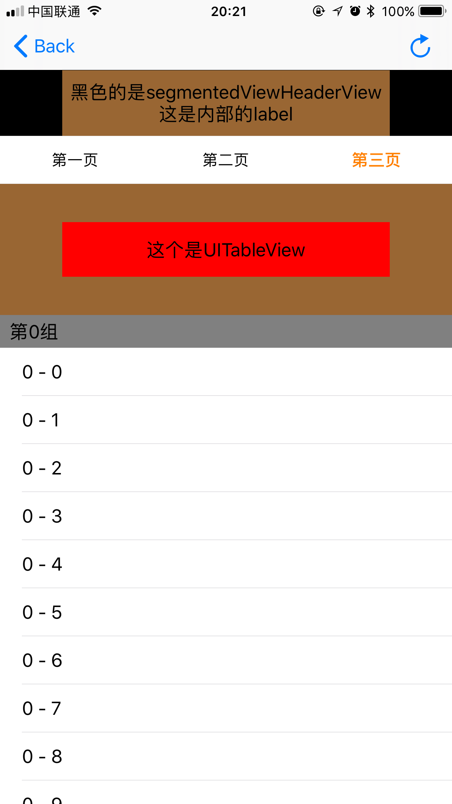
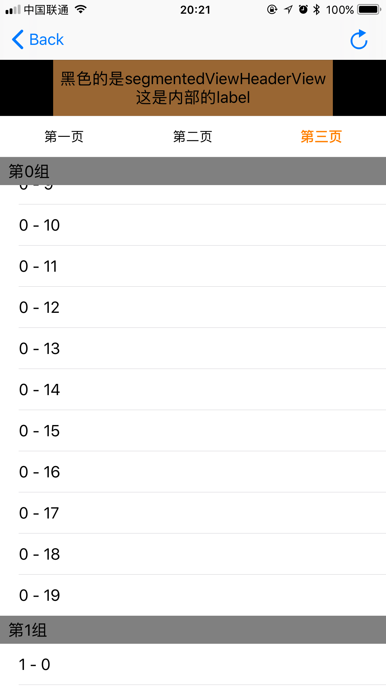

<div align="center">

TSegmentedView
------

</div>

<div align="center">

[](https://github.com/tobedefined/TSegmentedView/blob/master/LICENSE)&nbsp;
[](https://github.com/Carthage/Carthage)&nbsp;
[](http://cocoapods.org/)&nbsp;


</div>


<div align="center">

[English Document](README.md)

</div>

<div align="center">


</div>

### 特点

- 完美兼容`Objective-C`和`Swift(3/3.1/3.2/4)`
- 支持用户滑动和点击tab
- 支持滑动返回(在任意的tab)
- 支持`Frame`和`Autolayout`自动布局，你可以使用`Masonry`/`SnapKit`/`NSLayoutConstraint`去布局view
- 支持放入普通的`UIView`（以及非滑动的`UIView子类View`），`UIScrollView`，`UITableView`
- 支持的`UITableView`添加`tableHeaderView`
- 支持`UITableView`添加 section header view，并且显示不会出现悬停位置不正确的情况
- 支持自定义 `SegmentedControlView` （tab点选）的样式，你可以自己设置动画、自己设置高度等等等

> UIView支持

<div align="center">
    
</div>

> UIScrollView 支持

<div align="center">
    
</div>

> UITableView 支持添加 tableHeaderView

<div align="center">
    
</div>

> UITableView 支持添加 section header

<div align="center">
    
</div>

### 为什么做这个

现在很多类似的框架，但是还是做了一个，主要是因为网上大多数框架写死了`SegmentedControlView`(就是tab的样式)，另外最重要的一点是我试验过很多框架发现`UITableView`的`tableHeaderView`会有问题，而且一旦设置section header view，悬停都有问题，所以我就自己写了一个……

### 导入项目

#### 源文件

如果你的项目使用`Swift 3/3.1`，并且没使用`Xcode 9`，请下载`Source`目录中的`TSegmentedControlView.swift`、`TSegmentedView.swift`、`TSVExtension.swift`并放入你的项目中，无须其他配置即可使用。

如果你的项目使用`Xcode 9`，建议使用`CocoaPods`或者`Carthage`方式。

#### CocoaPods

[`CocoaPods`](https://cocoapods.org/)是一个Cocoa项目管理器。你可以使用以下命令去安装`CocoaPods`:

```bash
$ gem install cocoapods
```

要使用CocoaPods将`TSegmentedView`集成到您的Xcode项目中，请在`Podfile`中加入：

```ruby
source 'https://github.com/CocoaPods/Specs.git'
platform :ios, '8.0'
use_frameworks!

target '<Your Target Name>' do
    pod 'TSegmentedView'
end
```

然后运行一下命令:

```bash
$ pod install
```

#### Carthage


[`Carthage`](https://github.com/Carthage/Carthage)是一个去中心化的依赖管理器，它构建并提供所使用的库的framework。

你可以使用 [`Homebrew`](https://brew.sh/)并运行下面的命令安装Carthage

```bash
$ brew update
$ brew install carthage
```

要将`TSegmentedView`集成到使用Carthage的Xcode项目中，请在`Cartfile`中加入：

```ruby
github "tobedefined/TSegmentedView" ~> 1.1.0
```

运行`carthage update`构建framework，并将编译的`TSegmentedView.framework`拖入Xcode项目中。

### 如何使用

- swift

```swift
import TSegmentedView
```

- Objective-C

```objc
#import <TSegmentedView/TSegmentedView-Swift.h>
```

你可以在demo中看具体的使用方法，下面是具体的介绍

#### 遵守协议： `TSegmentedViewDelegate`

```swift
func segmentedViewTitles(in segmentedView: TSegmentedView) -> [String]

func segmentedView(_ view: TSegmentedView, viewForIndex index: Int) -> UIView
```

- 第一个函数是给`TSegmentedView`没一个tab的title赋值，array的count是tab的数量
- 第二个函数是给对应每个tab赋予所显示的view

可选的协议函数 

```swift

// 1 
@objc optional func segmentedView(_ view: TSegmentedView, didShow index: Int) -> Void

// 2.1 (Swift 3.2/4)
@objc optional func segmentedViewSegmentedControlView(in segmentedView: TSegmentedView) -> (UIView & TSegmentedControlProtocol)
// 2.2 (Swift 3/3.1)
@objc optional func segmentedViewSegmentedControlView(in segmentedView: TSegmentedView) -> UIView

// 3
// default is 0
@objc optional func segmentedViewFirstStartSelectIndex(in segmentedView: TSegmentedView) -> Int

// 4
// default is nil
@objc optional func segmentedViewHeaderView(in segmentedView: TSegmentedView) -> UIView

// 5
// default is segmentedViewHeaderView height
@objc optional func segmentedViewHeaderMaxHeight(in segmentedView: TSegmentedView) -> CGFloat

// 6
// default is segmentedViewHeaderView height
@objc optional func segmentedViewHeaderMinHeight(in segmentedView: TSegmentedView) -> CGFloat

// 7
// when scroll top or bottom, change the titles view height , will run this method
@objc optional func segmentedView(_ view: TSegmentedView, didChangeHeaderHeightTo height: CGFloat) -> Void

```

- 可选函数解释

  1. 函数是在`index`对应的view显示时候会调用，每次都会调用
  2. 函数返回定义的`SegmentedControlView`，需要为符合`TSegmentedControlProtocol`协议的`UIView`
  3. 函数返回`TSegmentedView`创建时候选择哪一个tab（默认选择第一个tab--> index = 0）
  4. 返回headerView（默认为nil）
  5. 设置header的最大高度（默认为header的frame的size.height）
  6. 设置header的最小高度（默认与最大高度相同）
  7. header高度发生变化时候会调用此函数，允许外面根据新的hight做一些动画等


### 关于 `TSegmentedControlProtocol`

你可以看到在`TSegmentedView.swift`中看到这个协议的定义

```swift
@objc protocol TSegmentedControlProtocol: class {
    func reloadData(with titles: [String]) -> Void
    func userScrollExtent(_ extent: CGFloat) -> Void
    func setAction(_ actionBlock: ((_ index: Int) -> Void)?) -> Void
}
```
- 作用：

    > `TSegmentedView`允许用户自定义`SegmentedControlView`而不是必须使用`TSegmentedControlView`

- 如何自定义`SegmentedControlView`

    > 首先创建的view必须是`UIView`的子类，然后符合`TSegmentedControlProtocol`协议，并实现这三个方法

- `func reloadData(with titles: [String]) -> Void`

    > 这个方法在`TSegmentedView` `reloadData`的时候回去调用，这个方法中需要实现更新对应tab的view创建删除显示等操作，`titles`的值为`TSegmentedControlView`的代理方法返回的 array

- `func userScrollExtent(_ extent: CGFloat) -> Void`

    > 这个方法在`TSegmentedView` 滑动（用户手动滑动）的时候回去调用，这个方法中需要实现更新对应tab的view显示样式或自定义一些动画等,`extent`的值为当前滑动的占比。例如有3个tab，则范围为`0.0 ~ 2.0`

- `func setAction(_ actionBlock: ((_ index: Int) -> Void)?) -> Void`

    > 这个方法需要你将`actionBlock`进行保存，并在点击tab时候进行调用`actionBlock`，这样才会滚动到对应tab的view的位置。（刚开始考虑是在协议中定义一个`actionBlock`的变量，为了兼容`Objective-C`，所以还是定义成函数。）


